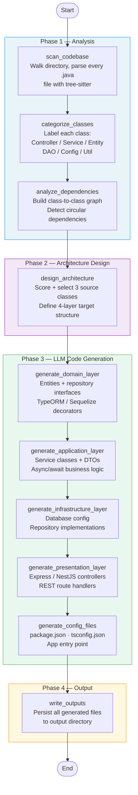

# Java-to-Node Agent

An AI-powered migration agent that converts Java/Spring Boot REST APIs into modern Node.js/TypeScript applications following Clean Architecture principles — orchestrated by a **LangGraph** state machine.

---

## Table of Contents

1. [Overview](#overview)
2. [LangGraph Workflow](#langgraph-workflow)
3. [Generated Output Structure](#generated-output-structure)
4. [Instructions to Run](#instructions-to-run)
5. [Configuration Reference](#configuration-reference)
6. [Token Limit Management](#token-limit-management)
7. [Assumptions and Limitations](#assumptions-and-limitations)
8. [Project Structure](#project-structure)
9. [Dependencies](#dependencies)
10. [Architecture Decisions](#architecture-decisions)

---

## Overview

### What the agent does

The agent reads a Java/Spring Boot project, parses every source file with a real AST parser ([tree-sitter](https://tree-sitter.github.io/tree-sitter/)), categorises all classes by role, maps their dependencies, and then uses an LLM to generate a fully structured, immediately runnable Node.js application in Clean Architecture.

Conversion is **scoped to three representative source classes**:

| Java source | Generated Node.js output |
|---|---|
| `@RestController` class | `presentation/controllers/{resource}.controller.ts` |
| `@Service` class | `application/use-cases/{resource}.service.ts` |
| `@Repository` / DAO class | `infrastructure/repositories/{entity}.repository.ts` |
| Matched `@Entity` class | `domain/entities/{entity}.entity.ts` + repository interface |

Focusing on three classes keeps each LLM call coherent and the output complete — rather than attempting a partial migration of every file in a large multi-module project.

### Key features

| Feature | Detail |
|---|---|
| **Multi-provider LLM** | OpenAI, Azure OpenAI (API key or OAuth service principal), Anthropic Claude |
| **Java AST parsing** | tree-sitter — extracts annotations, fields, methods without running Java |
| **Intelligent class selection** | Scoring heuristic automatically picks the best-fit Controller / Service / DAO |
| **Clean Architecture output** | Strict 4-layer dependency direction; framework-agnostic domain layer |
| **Configurable target** | Express or NestJS; TypeORM or Sequelize; TypeScript or JavaScript |
| **Browser UI** | Flask + Server-Sent Events — live streaming of each pipeline step |
| **Checkpointing** | SQLite-backed resumable runs via LangGraph |
| **3-layer token safety** | Semantic budgeting + context-aware truncation before every LLM call |

### High-level data flow

```
┌──────────────────────────────────────────────────┐
│               Java / Spring Boot Project          │
│   (Maven or Gradle, standard package layout)      │
└──────────────────────┬───────────────────────────┘
                       │  directory path
                       ▼
┌──────────────────────────────────────────────────┐
│            Java AST Parser (tree-sitter)          │
│  Extracts: classes, annotations, fields, methods  │
│  No Java runtime required                         │
└──────────────────────┬───────────────────────────┘
                       │  structured JavaClass objects
                       ▼
┌──────────────────────────────────────────────────┐
│          LangGraph Workflow (10 nodes)             │
│  Shared ConversionState flows through each node   │
│  (see diagram below)                              │
└──────────────────────┬───────────────────────────┘
                       │  generated file contents
                       ▼
┌──────────────────────────────────────────────────┐
│          Node.js Project (Clean Architecture)     │
│  Express / NestJS  ·  TypeORM / Sequelize         │
│  TypeScript / JavaScript                          │
└──────────────────────────────────────────────────┘
```

---

## LangGraph Workflow

The entire conversion pipeline is a **LangGraph directed graph**. Each node is a pure function: it receives the shared `ConversionState`, performs exactly one job, and returns an updated state slice. This design makes the pipeline deterministic, independently testable, and checkpointable (SQLite).

### Mermaid diagram



### Node reference

| # | Node | Phase | Input from state | Output to state |
|---|---|---|---|---|
| 1 | `scan_codebase` | Analysis | `repo_path` | `java_classes`, `total_files`, `parsed_files`, `parse_errors` |
| 2 | `categorize_classes` | Analysis | `java_classes` | `classes_by_category`, `selected_source_classes` |
| 3 | `analyze_dependencies` | Analysis | `java_classes` | `dependency_graph`, `circular_dependencies` |
| 4 | `design_architecture` | Design | `classes_by_category`, target framework/ORM settings | `architecture` (ModernArchitecture) |
| 5 | `generate_domain_layer` | Generation | Selected entity class | Entity `.ts`/`.js` + repository interface |
| 6 | `generate_application_layer` | Generation | Selected service class | Service class + DTOs |
| 7 | `generate_infrastructure_layer` | Generation | ORM preference | DB config + repository implementations |
| 8 | `generate_presentation_layer` | Generation | Selected controller class | Controller files with route handlers |
| 9 | `generate_config_files` | Generation | Architecture, selected classes, framework | `package.json`, `tsconfig.json`, entry point |
| 10 | `write_outputs` | Output | `generated_files` dict | Files written to `output_directory` |

### Shared state (`ConversionState`)

```
ConversionState (TypedDict)
│
├── repo_path                   str — input Java project directory
├── output_directory            str — where to write generated files
├── target_framework            "express" | "nestjs"
├── target_orm                  "typeorm" | "sequelize"
├── target_language             "typescript" | "javascript"
├── llm_provider                "openai" | "azure_openai" | "anthropic"
│
├── java_classes                list[JavaClass]   (populated by scan_codebase)
├── classes_by_category         dict[str, list[JavaClass]]
├── selected_source_classes     dict[str, JavaClass]  — controller / service / dao
├── dependency_graph            dict[str, list[str]]
├── circular_dependencies       list[list[str]]
│
├── architecture                ModernArchitecture  — 4-layer target design
│
├── generated_files             dict[str, str]  — path → file content
│
├── total_files                 int
├── parsed_files                int
└── parse_errors                list[str]
```

### Class selection heuristic (`design_architecture`)

The node scores every candidate class using `_role_fit_score()`:

```
Controller score  =  annotation_weight(@RestController=3, @Controller=2)
                   + path_prefix_weight(/api/=1)
                   + method_count_weight(>=3 public methods → +1)

Service score     =  annotation_weight(@Service=3, @Component=1)
                   + name_suffix_weight("Service"=2, "Manager"=1)

DAO score         =  annotation_weight(@Repository=3)
                   + name_suffix_weight("Repository"=2, "DAO"=2, "Dao"=1)
                   + extends_weight(JpaRepository, CrudRepository → +2)
```

The highest-scoring class in each role is selected. Ties are broken by class name length (shorter preferred — avoids overly specific helper classes).

---

## Generated Output Structure

```
output/
├── src/
│   ├── domain/
│   │   ├── entities/
│   │   │   └── {Entity}.entity.ts          # TypeORM / Sequelize entity
│   │   └── repositories/
│   │       └── I{Entity}Repository.ts      # Repository interface (port)
│   │
│   ├── application/
│   │   ├── use-cases/
│   │   │   └── {Resource}Service.ts        # Business logic service
│   │   └── dtos/
│   │       ├── Create{Entity}Dto.ts
│   │       ├── Update{Entity}Dto.ts
│   │       └── {Entity}ResponseDto.ts
│   │
│   ├── infrastructure/
│   │   └── repositories/
│   │       └── {Entity}Repository.ts       # ORM repository implementation
│   │
│   └── presentation/
│       └── controllers/
│           └── {resource}.controller.ts    # Express route handlers
│
├── index.ts / index.js                     # Express server entry point
├── package.json                            # Dependencies + scripts
├── tsconfig.json                           # (TypeScript only)
│
└── analysis/
    ├── selected_source_classes.json        # Metadata of selected Java classes
    └── conversion_traceability.json        # Java source → generated file mapping
```

### Clean Architecture dependency direction

```
presentation  →  application  →  domain  ←  infrastructure
(controllers)    (services)     (entities)   (repositories)

Rules enforced in generated code:
  ✓ Domain layer has ZERO external dependencies
  ✓ Application layer depends only on domain interfaces (ports)
  ✓ Infrastructure layer implements domain interfaces (adapters)
  ✓ Presentation layer calls application services only
```

---

## Instructions to Run

### Prerequisites

| Requirement | Version | Notes |
|---|---|---|
| Python | 3.10+ (3.11 recommended) | |
| pip | bundled with Python | |
| Visual C++ Build Tools 2022 | Windows only | Needed to compile `tree-sitter-java`. Install via the Visual Studio Installer under "Desktop development with C++". |
| LLM API key | — | OpenAI, Azure OpenAI, or Anthropic (see below) |

### Step 1 — Install dependencies

```bash
cd java-to-node-agent
pip install -r requirements.txt
```

> **Windows note:** If `tree-sitter-java` fails to compile, ensure Visual C++ Build Tools 2022 are installed, then retry.

### Step 2 — Configure your LLM provider

Copy `.env.example` to `.env` and fill in the values for your provider:

#### Option A: OpenAI

```env
LLM_PROVIDER=openai
OPENAI_API_KEY=sk-...
OPENAI_MODEL=gpt-4-turbo-preview       # optional, this is the default
```

#### Option B: Azure OpenAI — API key

```env
LLM_PROVIDER=azure_openai
AZURE_OPENAI_API_KEY=<your-key>
AZURE_OPENAI_ENDPOINT=https://<resource>.openai.azure.com/
AZURE_OPENAI_DEPLOYMENT_NAME=gpt-4
AZURE_OPENAI_API_VERSION=2024-02-15-preview
```

#### Option C: Azure OpenAI — OAuth (service principal)

```env
LLM_PROVIDER=azure_openai
TENANT_ID=<tenant-id>
CLIENT_ID=<client-id>
CLIENT_SECRET=<client-secret>
SCOPE=https://cognitiveservices.azure.com/.default
AZURE_ENDPOINT=https://<gateway>.openai.azure.com/
API_VERSION=2024-02-15-preview
MODEL_NAME=gpt-4
```

> The OAuth path uses `azure-identity` `ClientSecretCredential` with an auto-refreshing token — no API key needed in the environment.

#### Option D: Anthropic Claude

```env
LLM_PROVIDER=anthropic
ANTHROPIC_API_KEY=sk-ant-...
ANTHROPIC_MODEL=claude-3-5-sonnet-20240620   # optional
```

### Step 3 — Run the Web UI (recommended)

```bash
python ui.py
```

Open **http://localhost:5050** in your browser.

**Workflow in the UI:**

```
1. Enter the path to your local Java/Spring Boot project
           ↓
2. Click "Scan"
   → Agent walks the directory and shows discovered classes grouped by role
           ↓
3. Review the auto-selected Controller / Service / DAO
   (override the selection using the dropdowns if needed)
           ↓
4. Click "Convert"
   → Real-time streaming via Server-Sent Events shows each LangGraph node as it runs
           ↓
5. Inspect the generated files shown in the output panel
   → Files are also written to ./output/ on disk
```

### Step 4 (alternative) — Programmatic usage

```python
from src.graph.workflow import create_conversion_workflow
from src.graph.state import create_initial_state

workflow = create_conversion_workflow()

state = create_initial_state(
    repo_path="/path/to/java-project",
    output_directory="./output",
    target_framework="express",    # "express" | "nestjs"
    target_orm="typeorm",          # "typeorm" | "sequelize"
    target_language="typescript",  # "typescript" | "javascript"
    llm_provider="openai",         # "openai" | "azure_openai" | "anthropic"
)

result = workflow.invoke(state)
print(list(result["generated_files"].keys()))
```

#### With checkpointing (resumable runs)

```python
from src.graph.workflow import create_workflow_with_checkpoints

workflow = create_workflow_with_checkpoints(checkpoint_dir="./.checkpoints")
result = workflow.invoke(
    state,
    config={"configurable": {"thread_id": "my-project-run-1"}}
)
# Re-invoke with the same thread_id to resume from the last completed node
```

Checkpointing persists the full `ConversionState` to SQLite after every node. If the pipeline fails mid-way (e.g. transient LLM timeout), re-invoke with the same `thread_id` to continue from where it stopped.

---

## Configuration Reference

All settings are loaded from environment variables (`.env` file or system environment). The full reference:

```env
# ── LLM Provider ──────────────────────────────────────────────────────────────
LLM_PROVIDER=azure_openai          # openai | azure_openai | anthropic

# OpenAI
OPENAI_API_KEY=sk-...
OPENAI_MODEL=gpt-4-turbo-preview
OPENAI_TEMPERATURE=0.2

# Azure OpenAI — API key path
AZURE_OPENAI_API_KEY=...
AZURE_OPENAI_ENDPOINT=https://<resource>.openai.azure.com/
AZURE_OPENAI_DEPLOYMENT_NAME=gpt-4
AZURE_OPENAI_API_VERSION=2024-02-15-preview

# Azure OpenAI — OAuth path (takes precedence over API key if TENANT_ID is set)
TENANT_ID=...
CLIENT_ID=...
CLIENT_SECRET=...
SCOPE=https://cognitiveservices.azure.com/.default
AZURE_ENDPOINT=https://<gateway>.openai.azure.com/
API_VERSION=2024-02-15-preview
MODEL_NAME=gpt-4

# Anthropic
ANTHROPIC_API_KEY=sk-ant-...
ANTHROPIC_MODEL=claude-3-5-sonnet-20240620

# ── Code Generation ────────────────────────────────────────────────────────────
NODEJS_FRAMEWORK=express           # express | nestjs
ORM_PREFERENCE=typeorm             # typeorm | sequelize
LANGUAGE=typescript                # typescript | javascript
ARCHITECTURE_PATTERN=clean_architecture

# ── Output ────────────────────────────────────────────────────────────────────
OUTPUT_DIR=./output

# ── Token limits ──────────────────────────────────────────────────────────────
MAX_TOKENS=3000                    # tokens reserved for LLM output per call
                                   # (alias: MAX_TOKENS_PER_REQUEST)
TEMPERATURE=0.2                    # LLM temperature (0.0–1.0)

# ── Logging ───────────────────────────────────────────────────────────────────
LOG_LEVEL=INFO                     # DEBUG | INFO | WARNING | ERROR
```

---

## Token Limit Management

Token budget is managed in **three defensive layers** plus a **multi-pass recovery loop**. The layers prevent overflow; the recovery loop ensures no method is permanently lost when overflow occurs.

### Overview

```
┌─────────────────────────────────────────────────────────────┐
│  Layer 1 — Output cap (max_tokens)                          │
│  Reserves N tokens for the LLM's response on every call     │
│  Default: 3 000 tokens (configurable via MAX_TOKENS)         │
└──────────────────────────┬──────────────────────────────────┘
                           │ bounds response length
                           ▼
┌─────────────────────────────────────────────────────────────┐
│  Layer 2 — Semantic method budgeting (data-level, proactive)│
│  Trims method lists BEFORE building the prompt string        │
│  Keeps business logic; drops accessors and low-complexity    │
│  Budget: 2 000 tokens for methods_info                       │
│          1 000 tokens for source_context.methods             │
│  Returns (selected, dropped) — dropped list feeds Layer 4    │
└──────────────────────────┬──────────────────────────────────┘
                           │ compact, valid JSON
                           ▼
┌─────────────────────────────────────────────────────────────┐
│  Layer 3 — Last-resort string truncation (defensive)         │
│  Fires only if the full prompt still exceeds the context     │
│  window after Layer 2. Snaps to the last newline to avoid   │
│  cutting through a JSON structure.                           │
│  Sets _last_call_was_truncated flag → triggers Layer 4       │
└──────────────────────────┬──────────────────────────────────┘
                           │ first-pass code generated
                           ▼
┌─────────────────────────────────────────────────────────────┐
│  Layer 4 — Multi-pass recovery (MultiPassMerger)            │
│  Fires when Layer 2 dropped methods OR Layer 3 truncated     │
│  Runs up to MAX_PASSES extra LLM calls (default: 10)        │
│  Each pass handles the next batch of dropped methods         │
│  Merges all passes into a single coherent output file        │
└─────────────────────────────────────────────────────────────┘
```

### Layer 1 — Output cap

Every LLM call passes `max_tokens` to the underlying model client:

```python
ChatOpenAI(max_tokens=settings.max_tokens)        # default 3 000
AzureChatOpenAI(max_tokens=settings.max_tokens)
ChatAnthropic(max_tokens=settings.max_tokens)
```

This prevents runaway API costs and ensures the model stops generating before the response is arbitrarily long.

### Layer 2 — Semantic method budgeting

**Where it fires:** `generate_service_layer` in [src/generators/llm_code_creator.py](src/generators/llm_code_creator.py).

**Algorithm (`token_budget.budget_methods`):**

```
1. Tokenise each method dict using tiktoken (cl100k_base encoding)
2. Classify each method by semantic priority:

   Priority 3 — High-complexity non-accessor  → keep first (business logic)
   Priority 2 — Medium-complexity non-accessor → keep second
   Priority 1 — Low-complexity / unknown       → drop before accessors
   Priority 0 — Simple accessor                → drop first
               (get* / set* / is* where the char after the prefix is uppercase)

3. Greedy selection: iterate priority-descending, accumulate until budget exhausted
4. Restore original declaration order in both the selected and dropped subsets
5. Return (selected, dropped) — the dropped list is passed to Layer 4 for recovery
6. Log WARNING listing how many methods were dropped
```

**Budget constants** (conservative — safe for all models including GPT-4 8K):

| Prompt section | Token budget |
|---|---|
| `methods_info` (main method list) | 2 000 tokens |
| `source_context.methods` (supplemental Java context) | 1 000 tokens |
| Each extra-pass method batch | 1 000 tokens (half the main budget) |

**Why accessors are the correct things to drop first:**

```
Losing  getFirstName(), setActive(boolean)  →  near-zero quality impact
  TypeORM/Sequelize entities encode property types already.
  The LLM generates standard accessors by convention.

Losing  processPayment(), validateOrder()   →  direct quality degradation
  These carry the business intent that cannot be reconstructed.
```

**Endpoints are never trimmed.** Every HTTP route is semantically important and the endpoint list is already bounded upstream (max 15 per controller in `nodes.py`).

### Layer 3 — Last-resort string truncation

`LLMClient._truncate_prompt()` in [src/llm/llm_client_provider.py](src/llm/llm_client_provider.py) is a safety net for prompts that remain too large after Layer 2 (e.g. entities with very large property lists):

```
available_input_tokens = context_window − max_tokens

if tokens(system_prompt + user_prompt) > available_input_tokens:

    # Truncate user prompt to fit
    candidate = decode(user_token_ids[: available_input_tokens - 20])

    # Snap to last newline (avoids cutting through a JSON object mid-structure)
    if last_newline_position is within the last 30% of candidate:
        candidate = candidate[:last_newline_position]

    user_prompt = candidate + "\n[... input truncated to fit context window ...]"

    _last_call_was_truncated = True   ← signals Layer 4 to run recovery

    log WARNING(
        original_tokens  = N,
        truncated_tokens = M,
        context_window   = W,
        max_tokens       = T
    )
```

The newline-snap guarantees the prompt ends on a complete line so JSON arrays and objects are never left half-open. The `_last_call_was_truncated` flag on `LLMClient` is reset at the start of every `generate()` call and read immediately after by the generator to trigger Layer 4.

### Layer 4 — Multi-pass recovery

**Where it fires:** `generate_service_layer` in [src/generators/llm_code_creator.py](src/generators/llm_code_creator.py), orchestrated by `MultiPassMerger` in [src/generators/multi_pass_merger.py](src/generators/multi_pass_merger.py).

**Trigger conditions:**

| Condition | Description |
|---|---|
| `dropped_methods` is non-empty | Layer 2 dropped at least one method |
| `_last_call_was_truncated` is True | Layer 3 cut the prompt string |
| Either or both | Recovery runs regardless of which layer fired |

**Pass loop:**

```
passes_done = 1   (first pass already completed by generate_service_layer)

while dropped_methods remain AND passes_done < MAX_PASSES:

    batch = next budget-sized chunk of dropped_methods   (≤ 1 000 tokens)
    remaining = dropped_methods − batch

    extra_pass_prompt:
      "DO NOT redeclare the class. Output ONLY these missing methods as bare
       class methods (no class wrapper, no imports, no constructor):
       {batch}"

    extra_code = llm_client.generate(extra_pass_prompt)
    accumulated_code = merge(accumulated_code, extra_code)
    passes_done += 1

if any methods still remain after MAX_PASSES:
    log WARNING — increase MAX_PASSES or reduce method count
```

**Truncation sub-cases:**

| Sub-case | Condition | Recovery strategy |
|---|---|---|
| A | Layer 2 dropped methods + Layer 3 truncated | Use `dropped_methods` list — it's a clean, structured remainder |
| B | Layer 3 truncated but no methods were dropped | Recovery pass: LLM compares partial output against full original method list and generates what is missing |

**Merge strategy (in preference order):**

1. **Structural merge** (default) — strip the closing `}` from the accumulated class, append the extra-pass bare methods, re-close. No extra LLM call needed.
2. **LLM-assisted merge** (fallback) — if the extra-pass code still contains a class declaration despite the instruction, a third LLM call merges both fragments into one valid class.

**Deduplication guards applied after every merge:**

- `_dedup_imports_from_extra` — strips import lines from the extra-pass code that already exist in the accumulated class.
- `_dedup_imports_global` — re-emits unique import lines at the top after a structural merge.
- `_check_duplicate_methods` — detects methods with the same name in both fragments, logs a WARNING, and keeps the first-pass version.

**Configuration:**

| Environment variable | Default | Description |
|---|---|---|
| `ENABLE_MULTI_PASS` | `true` | Set to `false` to restore single-pass behaviour |
| `MAX_PASSES` | `10` | Maximum LLM calls per generated file (including the first pass) |

### Context window registry

`LLMClient.get_max_context_length()` maps known model names to their windows. Layer 3 uses this to compute `available_input_tokens`:

| Model pattern | Context window |
|---|---|
| `gpt-4` (base) | 8 192 tokens |
| `gpt-4-turbo`, `gpt-4o`, `gpt-4o-mini` | 128 000 tokens |
| `gpt-3.5-turbo`, `gpt-35-turbo` | 16 385 tokens |
| `claude-3-*`, `claude-3-5-*` | 200 000 tokens |
| Unknown Azure deployment | 128 000 tokens (safe default) |

### Why prompts are naturally compact

In practice Layers 2 and 3 rarely fire on typical Spring Boot classes. The agent **does not embed raw Java source code in prompts**. Instead, each prompt contains a structured JSON extract derived from the tree-sitter AST:

```
What the prompt contains              What it omits
──────────────────────────────────    ───────────────────────────────
Method name, signature, complexity    Method bodies
Field name, Java type, nullable       Annotation prose (@Column(...))
Relationship target + cardinality     Import statements
Business rule strings                 Comments
```

A service class with 15 methods typically produces a `methods_info` block of **300–500 tokens** — well within the 2 000-token budget. Multi-pass recovery is a backstop for unusually large classes, not the common path.

---

## Assumptions and Limitations

### Assumptions

| Assumption | Rationale |
|---|---|
| The input is a Maven or Gradle Spring Boot project with standard package layouts | The scanner searches for `.java` files recursively; non-standard structures still parse but class categorisation may be less accurate |
| One Controller, one Service, and one DAO/Repository are sufficient to demonstrate the migration | The agent generates a focused, complete example rather than attempting to migrate every file in a large multi-module project |
| The Java source files are syntactically valid | tree-sitter parses syntax; it does not resolve types or validate imports — broken Java may produce incomplete AST extractions |
| The target runtime is Node.js 18+ | Generated `package.json` and async/await patterns assume modern Node.js with ESM support |
| The ORM is TypeORM (default) or Sequelize | Other ORMs (Prisma, Mongoose, Drizzle) are not supported by the current generators |
| All Java source is in one project directory | Multi-module Maven projects with sibling directories require the agent to be pointed at each module separately |

### Known Limitations

| Limitation | Impact | Workaround |
|---|---|---|
| **Scope fixed at 3 source classes** | Large projects are not fully migrated in one run | Run the agent multiple times pointing at different Controller/Service/DAO combinations; each run produces a coherent vertical slice |
| **No cross-file type resolution** | Return types resolved via imports from other files may be missing from the domain model; method signatures may show `Object` instead of the specific type | Manually annotate the generated entity classes or add a post-processing step |
| **Generated code is a starting point** | Complex service methods with intricate business logic may be simplified or paraphrased by the LLM | Always review the generated service layer against the original Java source and add missing edge cases |
| **No test generation** | Unit and integration tests for the output code are not generated | Add tests manually or run a second agent pass focused on test generation |
| **Flask UI is single-user** | The Flask development server is single-threaded; concurrent conversion requests will queue | Use Gunicorn (`gunicorn ui:app`) for multi-user or CI scenarios |
| **No mid-run cancellation** | Once `/convert` is called, the LangGraph pipeline runs to completion; there is no mid-run cancel from the UI | Kill the Flask process; the partial state is not written to disk until `write_outputs` |
| **NestJS output is experimental** | The primary, well-tested target is Express. NestJS generation is available but not as thoroughly validated | Use Express for production migrations; NestJS can be enabled for evaluation |
| **Large Java files may produce truncated prompts** | See [Token Limit Management](#token-limit-management) above | Lower-priority methods are dropped first; a truncation warning is logged; the generated output may be missing low-priority methods |
| **No support for Spring Security / auth** | Security annotations (`@PreAuthorize`, `@Secured`) are parsed but no auth middleware is generated | Add authentication middleware (Passport.js, JWT) to the Express app manually |
| **No database migration scripts** | Only ORM entity definitions are generated — no Flyway/Liquibase-equivalent migration SQL | Use TypeORM's `synchronize: true` for development; generate migrations with `typeorm migration:generate` before production |

---

## Project Structure

```
java-to-node-agent/
│
├── ui.py                              # Flask web UI — run with: python ui.py
├── requirements.txt                   # Python dependencies
├── .env.example                       # Environment variable template
│
├── src/
│   │
│   ├── config/
│   │   └── settings.py                # pydantic-settings — all env vars + defaults
│   │
│   ├── graph/                         # LangGraph workflow
│   │   ├── state.py                   # ConversionState TypedDict definition
│   │   ├── workflow.py                # Graph builder (node registration + edges)
│   │   └── nodes.py                   # One function per workflow node (10 nodes)
│   │
│   ├── parsers/                       # Java AST parsing (tree-sitter)
│   │   ├── tree_sitter_parser.py      # tree-sitter Java wrapper
│   │   ├── ast_extractor.py           # Extracts class metadata from AST nodes
│   │   └── queries.py                 # tree-sitter S-expression queries
│   │
│   ├── analyzers/                     # Java codebase analysis
│   │   ├── code_scanner.py            # Discovers and reads .java files
│   │   ├── class_categorizer.py       # Labels classes by role
│   │   ├── dependency_mapper.py       # Builds class-to-class dependency graph
│   │   └── project_analyzer.py        # Orchestrates scan → categorize → deps
│   │
│   ├── generators/                    # Code generation
│   │   ├── base_code_creator.py       # Abstract base (Template Method pattern)
│   │   ├── llm_code_creator.py        # LLM-driven generator for all CA layers
│   │   └── token_budget.py            # Semantic method budgeting (Layer 2)
│   │
│   ├── llm/
│   │   ├── llm_client_provider.py     # Provider factory + Layer 3 truncation
│   │   └── prompts/                   # System and user prompt templates
│   │
│   └── models/                        # Pydantic data models
│       ├── java_models.py             # Parsed Java constructs (JavaClass, JavaMethod…)
│       ├── domain_models.py           # Domain objects (DomainEntity, APIEndpoint…)
│       ├── architecture_models.py     # ModernArchitecture target design schema
│       └── output_models.py           # Output file manifest models
│
└── docs/
    └── adr/                           # Architecture Decision Records
```

---

## Dependencies

| Package | Version | Purpose |
|---|---|---|
| `langgraph` | >=0.2.0 | Stateful workflow orchestration — directed graph with shared state |
| `langchain` | >=0.3.0 | LLM abstractions, prompt management, message types |
| `langchain-core` | >=0.3.0 | Core LangChain types and interfaces |
| `langchain-openai` | >=0.3.0 | OpenAI and Azure OpenAI chat model integration |
| `langchain-anthropic` | >=0.2.0 | Anthropic Claude chat model integration |
| `azure-identity` | >=1.15.0 | Azure OAuth token provider (`ClientSecretCredential`) |
| `tree-sitter` | >=0.22.0 | Fast, incremental Java AST parsing |
| `tree-sitter-java` | >=0.21.0 | Java grammar plugin for tree-sitter |
| `tiktoken` | >=0.7.0 | Token counting for prompt budgeting and truncation |
| `pydantic` | >=2.4.0 | Domain models, data validation, serialisation |
| `pydantic-settings` | >=2.0.0 | Environment-based configuration loading |
| `python-dotenv` | >=1.0.0 | `.env` file loading |
| `flask` | >=3.0.0 | Web UI HTTP server with Server-Sent Events |
| `rich` | >=13.0.0 | Terminal progress output and logging |
| `httpx` | >=0.25.0 | Async/sync HTTP client (Azure OAuth token refresh) |
| `pytest` | >=7.4.0 | Test framework |

---

## Architecture Decisions


All significant design decisions are documented as Architecture Decision Records in [docs/adr/](docs/adr/).

| ADR | Decision | Status |
|---|---|---|
| [ADR-001](java-to-node-agent/docs/adr/ADR-001-langgraph-workflow-orchestration.md) | Use LangGraph for workflow orchestration | Accepted |
| [ADR-002](java-to-node-agent/docs/adr/ADR-002-llm-based-code-generation.md) | LLM-based code generation over rule-based transformation | Accepted |
| [ADR-003](java-to-node-agent/docs/adr/ADR-003-multi-provider-llm-support.md) | Multi-provider LLM support (OpenAI, Azure, Anthropic) | Accepted |
| [ADR-004](java-to-node-agent/docs/adr/ADR-004-rag-with-chromadb.md) | RAG with ChromaDB | Superseded by ADR-002 |
| [ADR-005](java-to-node-agent/docs/adr/ADR-005-tree-sitter-java-parsing.md) | tree-sitter for Java AST parsing | Accepted |
| [ADR-006](java-to-node-agent/docs/adr/ADR-006-clean-architecture-output.md) | Clean Architecture as target output structure | Accepted |
| [ADR-007](java-to-node-agent/docs/adr/ADR-007-shared-state-pipeline.md) | Shared state pipeline pattern for workflow nodes | Accepted |
| [ADR-008](java-to-node-agent/docs/adr/ADR-008-template-method-generators.md) | Template Method pattern for code generators | Accepted |
| [ADR-009](java-to-node-agent/docs/adr/ADR-009-pydantic-domain-models.md) | Pydantic for domain and data transfer models | Accepted |
| [ADR-010](java-to-node-agent/docs/adr/ADR-010-environment-based-configuration.md) | Environment-based configuration with pydantic-settings | Accepted |
| [ADR-011](java-to-node-agent/docs/adr/ADR-011-flask-web-ui.md) | Flask Web UI with Server-Sent Events | Accepted |
